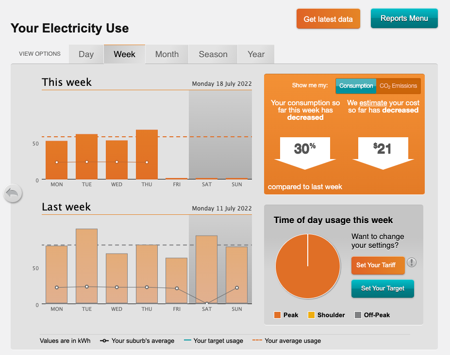
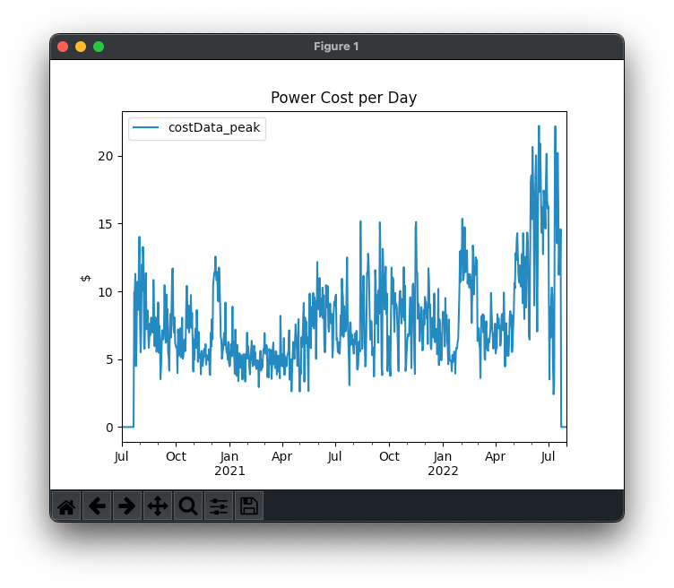
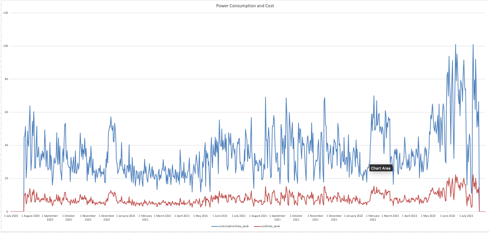

# Save Power Data

I just got solar panels installed at my house, and want to start looking at my power consumption, generation, cost etc.
My power distributor has a [web interface](https://energyeasy.ue.com.au/) that allows you to view historical power
usage, cost, generation etc.  That's great, but the data only goes back two years, and the graphs are pretty limited.



To solve this, here's a little script that downloads all the historical data into a local Pandas Dataframe.  From there
it could be used for all kinds of analysis, progressively updated, etc.  The script also creates an XLS with the data,
and renders a simple graph to the screen.





## Usage

```commandline
pip install -r requirements.txt

USERNAME=yourlogin PASSWORD=yourpassword fetch.py
```

## Code

Besides the need to get the data, this was partly an exercise to learn [Pandas](https://pandas.pydata.org/):

> pandas is a fast, powerful, flexible and easy to use open source data analysis and manipulation tool,
> built on top of the Python programming language.

